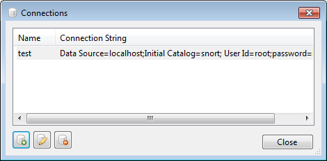
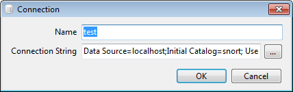
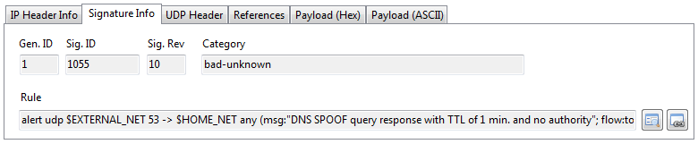

snorbert
========

snorbert is a [snort](http://www.snort.org/) data viewer, loosely based on [snorby](https://snorby.org/). It is written in C# and uses .Net 4.5.

The aim of the application is to provide a fast, usable interface for accessing snort data. Depending on the snort deployment, the underlying data set can be extremely large, so care has been taken to optimise the data access. snorbert has various useful features:

## Features ##

- Paged data access
- Configuration for multiple snort instances
- Signature based grouping of events
- User configurable searching
- Correlation of snort signatures to events for easy viewing of the signatures
- Query integration with NetWitness for quick session identification

## Third party libraries ##

- [CsvHelper](https://github.com/JoshClose/CsvHelper): CSV output
- [Be.HexEditor](http://sourceforge.net/projects/hexbox/) : HEX view of packet data
- [IP Address Control](https://code.google.com/p/ipaddresscontrollib/) : Easy validation of IP addresses
- [MySql](http://dev.mysql.com/downloads/connector/net/) : Access to snort MySQL databases
- [NPoco](https://github.com/schotime/NPoco): Data access
- [ObjectListView](http://objectlistview.sourceforge.net/cs/index.html) : Data viewing via lists 
- [Utility](http://www.woanware.co.uk) (woanware) : My helper library

## Requirements ##

- Microsoft .NET Framework v4.0
- snort/barnyard database change (see below)

## Database ##
snorbert requires a number of changes to the snort/barnyard database schema. The following files should be run to create new tables:

- Database\acknowledgment.sql 
- Database\acknowledgment_class.sql
- Database\exclude.sql
- Database\rule.sql

Then the data population script (acknowledgment\_class.data.sql) should be run to populate the **acknowledgment_class** table. The exclude table facilities the ability to exclude particular rules, IP addresses etc. The **acknowledgement** tables allow for better collaborative working so that one analyst can see that another analyst is already working on a particular rule.

It should be noted that signatures with a **sig_priority** of 99 will not be shown on the rules tab, unless the user explictly selects the 99 priority value in the drop down located on the Rules tab. 

# Usage #

## Connections ##

snorbert can connect to multiple snort instances. The database connections need to be defined for each snort instance. The database connections can be configured via the Tools->Connections menu. The Connections window will display all of the configured snort databases.

 
The Connections window allows the adding, editing and deleting of database connections. The Connection window is shown below:

 
The ellipsis button will perform a connection test for the currently configured connection string. The connection string must be in the following format:
Data Source=#IP#;Initial Catalog=#Database#; User Id=#username#;password=#password#; default command timeout=60;

Note that the default command timeout can be configured for each instance, this allows for slow network connections, large datasets etc.

## Rules/Signatures ##

The Signature Info tab provides details about the signature used in the alert. The rules is directly loaded from the database when the event details are retrieved. The screen shot below shows the signature details:

 
To view the full rule in a separate window, click the button next to the rule, the following window will be displayed:

The second button allows the user to view rules that are linked using the Snort **flowbits:isset** details.

## False Positives ##

To help reduce the amount of “noise” returned by snort it is possible to aid false positive filters to the data set. The false positive filters are only application to the Rules tab since they relate a filter to a specific snort rule.

To add a false positive filter, load the events for a rule, then right click on the Event line within the list. A context menu will be displayed, choose the Hide item. The following window will be displayed:
 

The values will be pre-populated using the event selected in the list; this is to speed up the process. To remove false positive filters, use the Tools->False Positive menu item, which will display the False Positives window:

 
Select the false positive filter that you want to delete and use the delete button on the window or use the DEL key.

## Alerts ##

snobert has the ability to alert the user when important events have triggered. The Alerts are configured via the Alerts.xml file that should be placed in the users AppData directory for the application e.g.

    C:\:\Users\woanware\AppData\Local\woanware\snorbert\Alerts.xml

The format of the config file is shown below:

    <?xml version="1.0" encoding="utf-8"?>
    <Alerts xmlns:xsi="http://www.w3.org/2001/XMLSchema-instance" xmlns:xsd="http://www.w3.org/2001/XMLSchema">
      <Interval>60</Interval>
      <Priorities>
        <int>1</int>
      </Priorities>
      <Keywords>
	    <string>[BADSTUFF]</string>
      </Keywords>
    </Alerts> 

The Interval (minutes) value is used to configure an internal timer which is used to perform the check in the background. The Priorities section is used to define any priority signatures that need to be alerted. The Keywords section is used to alert on signatures that have specific keywords in the signature name.

When events are identified that match any alerting criteria a message box is displayed and the applications window is flashed. The rule which has the new events against it will have red text. The red text will only be shown until the next automatic refresh/check

## Commands ##

User configurable commands can be executed via the Rules list context menu. The commands are stored in the Commands.xml file located in the user’s application data directory for the application. The command strings will have data substitutions applied using the following mark up so that event data can be passed to the commands:

    	#IP_SRC#
    	#IP_DST#
    	#PORT_SRC# 
    	#PORT_DST#
    	#PROTO#
    	#SENSOR_ID#
        #SENSOR_NAME#
        #TIMESTAMP#

If the command ("Name") contains "http://" or "https://" then the sensor name will be URL encoded. Also if the command contains an "&", then the "&" should be replaced with "&amp;". The timestamp value will be converted into UNIX epoch time.
